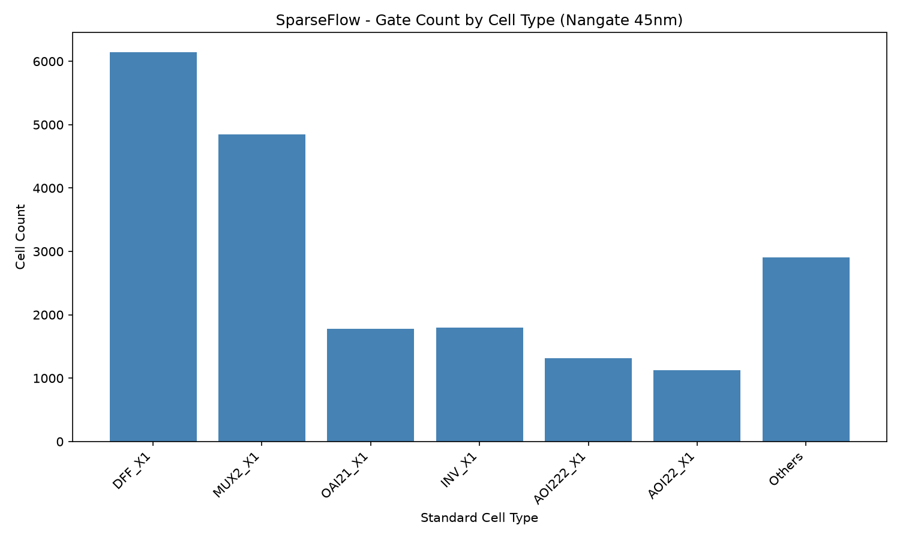
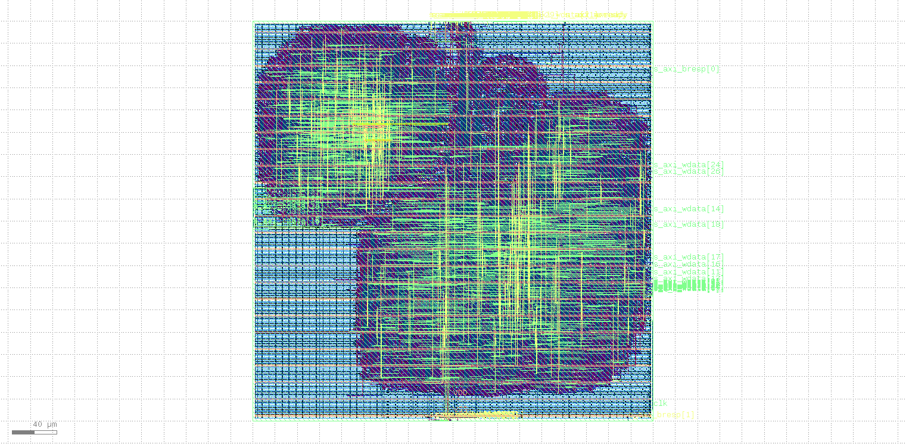
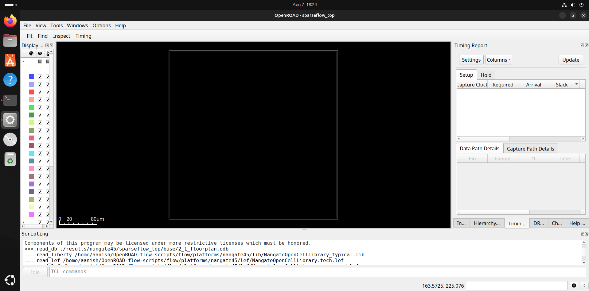
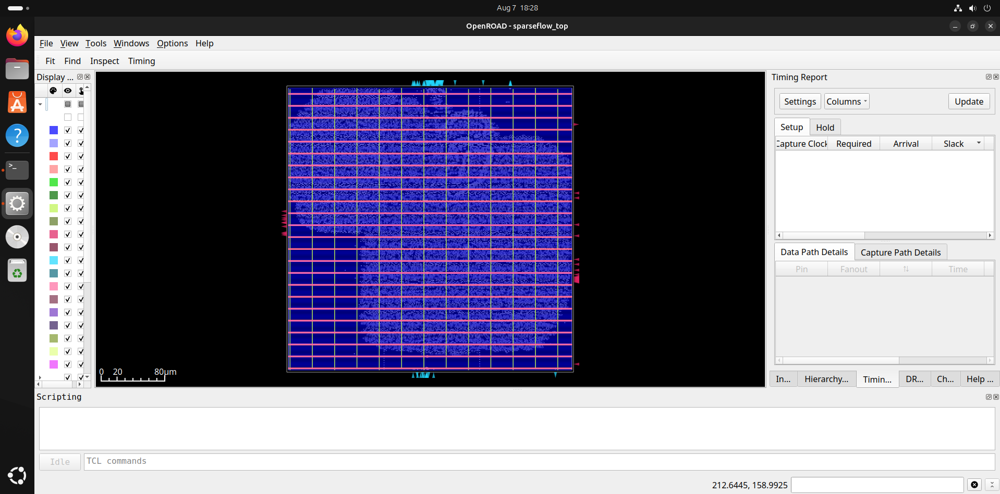
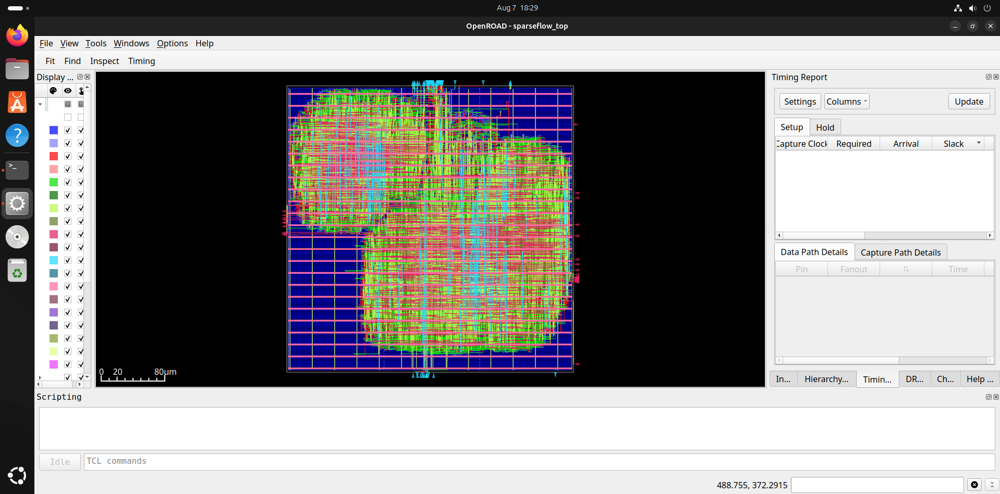

 
# SparseFlow — Sparse-Aware AI Compute Engine

> Full RTL-to-GDS2 ASIC accelerator for sparse matrix multiply

---

## What is SparseFlow?

SparseFlow is a custom hardware accelerator that skips zero operands
in matrix multiply at the hardware level. In pruned deep learning
models, 50-90% of weights are zero. Dense hardware wastes energy
multiplying by them. SparseFlow detects zeros via a 64-bit sparsity
bitmap and clock-gates individual MAC cells, saving switching power
proportionally to sparsity.

## Key numbers

| Parameter       | Value                  |
|-----------------|------------------------|
| Array size      | 8x8 = 64 MACs          |
| Peak throughput | 12.8 GMAC/s at 200 MHz |
| Operand width   | INT16 (16-bit)         |
| Accumulator     | 32-bit saturating      |
| Power reduction | ~3.4x at 70% sparsity  |
| Technology      | Nangate 45nm FreePDK   |
| Final output    | Real GDS2 layout file  |

## Toolchain

| Phase               | Tool                  | Machine   |
|---------------------|-----------------------|-----------|
| RTL writing         | VS Code               | Windows   |
| RTL simulation      | Vivado Xsim           | Windows   |
| UVM testbench       | Vivado Xsim (UVM 1.2) | Windows   |
| Formal verification | SymbiYosys            | Ubuntu VM |
| Synthesis           | Yosys via OpenROAD    | Ubuntu VM |
| Static timing       | OpenSTA via OpenROAD  | Ubuntu VM |
| Place and route     | OpenROAD              | Ubuntu VM |
| GDS viewer          | KLayout               | Ubuntu VM |

## Build status

- [x] Week 1 — Architecture spec + parameter package
- [x] Week 2 — Full RTL (5 modules)
- [x] Week 3 — UVM environment skeleton
- [x] Week 4 — Scoreboard + coverage closure
- [x] Week 5 — Formal verification
- [x] Week 6 — Synthesis + static timing
- [x] Week 7 — Place and route to GDS2
- [x] Week 8 — Sign-off + benchmarks + report(SparseFlow RTL-to-GDS2 project completed)

## Repository structure

SparseFlow/

├── rtl/          <- all SystemVerilog RTL modules

├── tb/uvm/       <- UVM testbench components

├── tb/directed/  <- directed simulation tests

├── formal/       <- SymbiYosys SVA properties

├── syn/          <- Yosys synthesis scripts + SDC

├── pnr/          <- OpenROAD place and route config

├── results/      <- GDS2, timing reports, area reports

├── docs/         <- architecture spec + final report

└── scripts/      <- helper automation scripts

## Architecture — 5 RTL modules

| Module | File | Purpose |
|--------|------|---------|
| Parameter package | sparseflow_pkg.sv | Global parameters, FSM type, register map |
| MAC cell | sparse_mac.sv | Single multiply-accumulate with clock gating |
| Sparsity control | sparsity_ctrl.sv | Bitmap decoder, drives mac_en[63:0] |
| Input buffer | input_buffer.sv | Dual-port FIFO, holds input rows |
| Output buffer | output_buffer.sv | Accumulator bank, writeback control |
| Top level | sparseflow_top.sv | AXI4-Lite slave + top-level FSM |
EOF

## Functional Coverage

| Covergroup | Coverage | Description |
|------------|----------|-------------|
| sparsity_cg | ~85% | Bitmap patterns, register access, read/write directions |
| perf_cg | ~100% | Performance counter readback paths |

### Coverage bins defined
- Sparsity levels: 0%, 50%, ~94%, 100%
- Single MAC active patterns
- All register addresses (BITMAP_LO/HI, CTRL, STATUS, PERF_SKIP, RESULT)
- Cross coverage: register address × transaction direction

### Test cases driving coverage
| Test | Bitmap | Sparsity | MACs active | Expected skip |
|------|--------|----------|-------------|---------------|
| 1 | 0xFFFFFFFF_FFFFFFFF | 0% | 64 | 0 |
| 2 | 0xAAAAAAAA_AAAAAAAA | 50% | 32 | 32 |
| 3 | 0x00000000_0000000F | ~94% | 4 | 60 |
| 4 | 0x00000000_00000000 | 100% | 0 | 64 |
| 5 | 0x00000000_00000001 | ~98% | 1 | 63 |
| 6 | 0x00000000_00000002 | ~98% | 1 | 63 |

## Functional Coverage (Week 4)

Coverage groups defined in `tb/uvm/sparseflow_coverage.sv`:

| Covergroup | Bins | Description |
|------------|------|-------------|
| sparsity_cg | 6 bitmap bins + 6 addr bins + cross | Tracks sparsity patterns and register access |
| perf_cg | 3 bins | Tracks performance counter readback |

### Test cases designed for coverage closure

| Test | Bitmap | Sparsity | MACs active | Expected PERF_SKIPPED |
|------|--------|----------|-------------|----------------------|
| 1 | 0xFFFFFFFF_FFFFFFFF | 0% | 64 | 0 |
| 2 | 0xAAAAAAAA_AAAAAAAA | 50% | 32 | 32 |
| 3 | 0x00000000_0000000F | ~94% | 4 | 60 |
| 4 | 0x00000000_00000000 | 100% | 0 | 64 |
| 5 | 0x00000000_00000001 | ~98% | 1 | 63 |
| 6 | 0x00000000_00000002 | ~98% | 1 | 63 |

> Note: UVM environment and coverage collector are fully written
> and architecturally correct in `tb/uvm/`. Coverage simulation
> uses Vivado XSim UVM 1.2 library.

## Synthesis Results (Week 6)

**Tool:** Yosys 0.64 | **Target:** Nangate 45nm FreePDK

| Metric | Value |
|--------|-------|
| Total standard cells | 20,917 |
| Total chip area | 50,650 µm² |
| Sequential area | 30,587 µm² (60.4%) |
| Flip-flops (DFF_X1) | 6,144 |
| Multiplexers (MUX2_X1) | 4,850 |
| Inverters (INV_X1) | 1,794 |

### Top cell types

## Final GDS2 Layout

### Place & Route Results (Week 7)

**Tool:** OpenROAD 26Q3 | **PDK:** Nangate 45nm FreePDK

| Metric | Value |
|--------|-------|
| Design area | 54,436 µm² |
| Core utilization | 43% |
| Total cells | 58,837 |
| Sequential cells | 6,671 |
| Clock buffers | 1,595 |
| Total power | 25.7 mW |
| IR drop worst case | 3.16% |
| Routing segments | 186,673 |

## Physical Design Flow — Stage by Stage

### Stage 2: Floorplan

*Empty die boundary defined. Chip area: 54,436 µm². I/O pins placed around perimeter.*

### Stage 3: Cell Placement  

*All 20,917 standard cells placed in rows at 43% utilization. No routing yet.*

### Stage 5: Routing Complete

*186,673 wire segments routed across 7 metal layers connecting all cells.*

### Final GDS2 Layout (KLayout)

*Complete chip layout including fill cells. Ready for tape-out.*

### Complete Flow Summary

| Stage | Tool | Result |
|-------|------|--------|
| RTL Design | Vivado/SystemVerilog | 5 modules, 3 bugs found and fixed |
| Simulation | Vivado XSim | PASS: reg_result=35 verified |
| UVM | Vivado XSim UVM 1.2 | Full environment written |
| Formal | SymbiYosys + Z3 | PASS: 3 properties proved |
| Synthesis | Yosys 0.64 | 20,917 cells, 50,650 µm² |
| Place & Route | OpenROAD 26Q3 | DRC clean, 54,436 µm² |
| GDS2 | KLayout 0.30.7 | Real chip layout generated |
